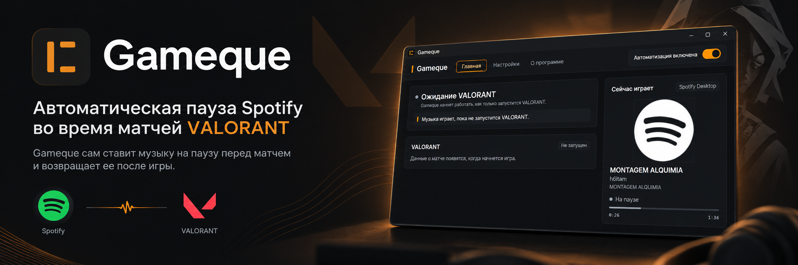
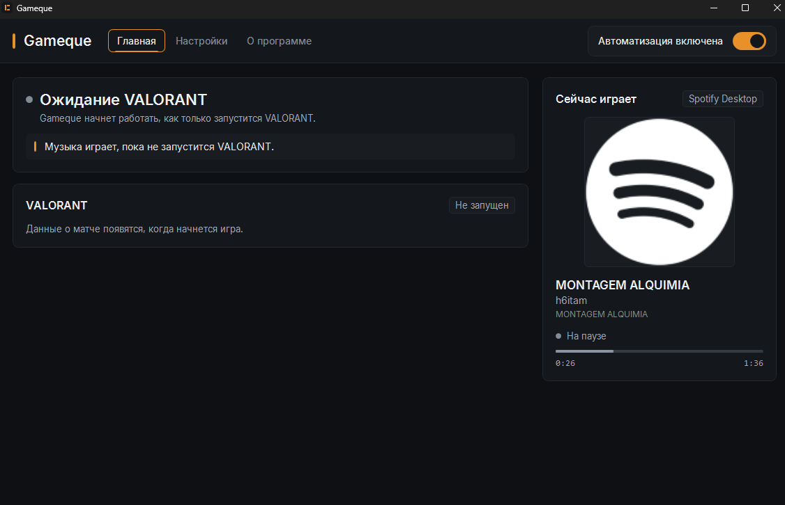
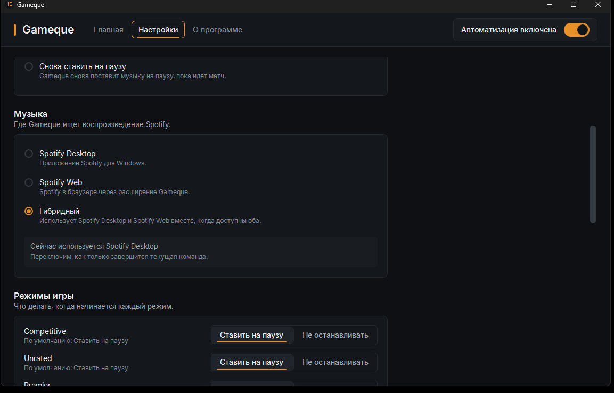
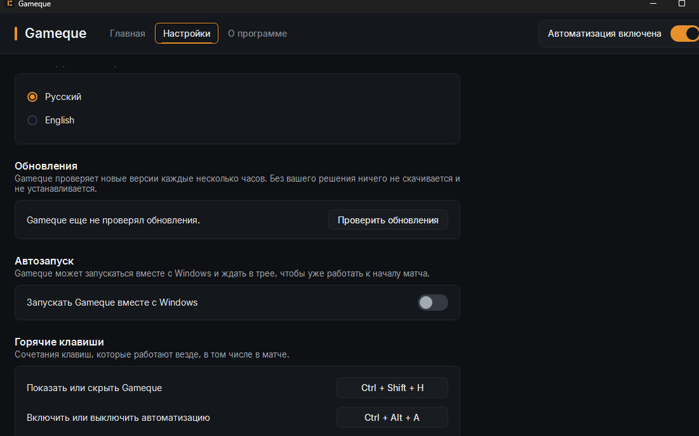

Русский | [English](README.en.md)

<p align="center">
  
</p>

<h1 align="center">Gameque</h1>

<p align="center">
  <b>Автоматическая пауза Spotify во время матчей VALORANT.</b><br>
  Gameque сам ставит музыку на паузу перед матчем и возвращает ее после игры.
</p>

<p align="center">
  <a href="https://github.com/IskhakovMA/Gameque-Releases/releases/latest"></a>
</p>

<p align="center">
  
  <a href="https://github.com/IskhakovMA/Gameque-Releases/releases/latest"></a>
</p>

<p align="center">
  
</p>

---

## Что такое Gameque

Gameque — небольшое приложение для Windows, которое следит за состоянием матча в VALORANT и само управляет воспроизведением Spotify. Когда начинается матч, музыка встает на паузу; когда матч заканчивается, она продолжает играть. Gameque работает со Spotify Desktop и Spotify Web, а для каждого режима игры можно выбрать, ставить ли музыку на паузу.

## Как это работает

```
VALORANT  →  Gameque видит, что начинается матч  →  Spotify на паузе
          →  матч окончен                         →  музыка играет снова
```

- **Момент паузы** настраивается: выбор агента, загрузка матча или начало самого матча.
- **Режимы игры** настраиваются по отдельности: например, в Deathmatch музыку можно не останавливать.
- **Если вы включили музыку сами** во время матча, Gameque по умолчанию больше не трогает ее до следующего матча. Это тоже можно изменить.

## Возможности

- Автоматическая пауза и возобновление Spotify по ходу матча
- Определение состояния VALORANT: меню, очередь, выбор агента, загрузка, матч
- Spotify Desktop
- Spotify Web через браузерное расширение Gameque — публичная установка расширения и публикация в магазинах еще готовятся ([подробнее](#spotify-desktop-и-spotify-web))
- Настраиваемый момент паузы
- Отдельное поведение для каждого режима игры
- Работа в трее: закрытие окна не останавливает Gameque
- Глобальные горячие клавиши: показать или скрыть окно (`Ctrl+Shift+H`), включить или выключить автоматизацию (`Ctrl+Alt+A`)
- Запуск вместе с Windows (выключен по умолчанию)
- Автоматический поиск обновлений

Русский и английский интерфейс уже реализованы и появятся в следующем публичном выпуске. Текущий публичный выпуск пока на английском.

## Spotify Desktop и Spotify Web

**Spotify Desktop** работает сразу: Gameque управляет им через стандартную систему управления медиа в Windows. Вход в аккаунт Spotify через Gameque не нужен.

**Spotify Web** в браузере работает через браузерное расширение Gameque для Chrome и Edge. Установщик Gameque уже регистрирует связь приложения с браузером, но само расширение пока не опубликовано в Chrome Web Store и Edge Add-ons: публикация и понятная установка для пользователей еще готовятся. До этого надежнее всего использовать Spotify Desktop.

## Скриншоты

<p align="center">
  
  <br><sub>Главный экран</sub>
</p>

<table>
  <tr>
    <td width="50%" align="center">
      
      <br><sub>Настройки</sub>
    </td>
    <td width="50%" align="center">
      
      <br><sub>Обновления</sub>
    </td>
  </tr>
</table>

## Установка

1. Откройте [последний выпуск](https://github.com/IskhakovMA/Gameque-Releases/releases/latest).
2. Скачайте `Gameque-<версия>-setup.exe`.
3. Запустите установщик. Права администратора не нужны: Gameque устанавливается для текущего пользователя.
4. Запустите Gameque из меню «Пуск».

Если Windows SmartScreen показывает предупреждение, прочитайте [ответ ниже](#почему-windows-smartscreen-может-показывать-предупреждение).

## Обновления

Установленный Gameque сам проверяет этот репозиторий на наличие новой версии — вскоре после запуска и затем примерно раз в шесть часов.

- Найденное обновление показывается в приложении и одним уведомлением Windows.
- Ничего не скачивается и не устанавливается без вашего решения.
- Перед запуском скачанного установщика Gameque сверяет его размер и SHA-256 с данными выпуска в `release.json`. Файл, который не совпадает, удаляется и не запускается.
- Обновление устанавливается обычным установщиком поверх текущей версии; настройки сохраняются.

## Безопасность и приватность

- Для Gameque не нужен аккаунт.
- Состояние VALORANT Gameque узнает, только читая локальный файл журнала игры. В процессы игры Gameque не вмешивается.
- Spotify Desktop управляется через стандартную систему управления медиа в Windows; Gameque не запрашивает данные вашего аккаунта Spotify.
- Проверка обновлений — анонимный запрос к публичным выпускам этого репозитория.
- Установщики в выпусках сопровождаются контрольной суммой SHA-256, и встроенный механизм обновления проверяет ее перед запуском.
- В этом репозитории нет исходного кода Gameque.

## Системные требования

- Windows 10 версии 1809 или новее, либо Windows 11
- 64-разрядная (x64) Windows
- VALORANT
- Spotify Desktop или Spotify Web

## Вопросы и ответы

### Нужно ли держать Gameque открытым?

Да, Gameque должен быть запущен, но окно можно закрыть: приложение продолжит работать в трее. Чтобы не запускать его вручную, включите запуск вместе с Windows в настройках. Полностью выйти можно через меню значка в трее.

### Работает ли со Spotify Desktop?

Да. Это основной и самый простой вариант.

### Работает ли со Spotify Web?

Да, через браузерное расширение Gameque. Расширение пока не опубликовано в магазинах Chrome и Edge — [подробнее выше](#spotify-desktop-и-spotify-web).

### Можно ли отключить автоматизацию для Deathmatch?

Да. Для каждого режима игры можно выбрать, ставить ли музыку на паузу: в настройках, раздел режимов игры. Автоматизацию можно и полностью выключить переключателем в окне приложения или сочетанием `Ctrl+Alt+A`.

### Устанавливаются ли обновления автоматически?

Нет. Gameque сам находит новую версию и сообщает о ней, но скачивание и установка происходят только по вашему решению.

### Почему Windows SmartScreen может показывать предупреждение?

Установщик Gameque пока не подписан сертификатом разработчика, поэтому SmartScreen может предупредить о неизвестном издателе. Подпись кода планируется, но еще не настроена. Скачивайте Gameque только со [страницы выпусков](https://github.com/IskhakovMA/Gameque-Releases/releases) этого репозитория; при желании проверьте файл, как описано ниже.

## Проверка загрузки

Необязательно для обычной установки.

Каждый [выпуск](https://github.com/IskhakovMA/Gameque-Releases/releases) содержит три файла:

| Файл | Что это |
|---|---|
| `Gameque-<версия>-setup.exe` | Установщик для Windows |
| `Gameque-<версия>-setup.exe.sha256` | Его SHA-256 в формате `sha256sum` |
| `release.json` | Версия, тег, исходный коммит, имя установщика, размер и контрольная сумма |

Файлы собираются и проверяются конвейером выпусков Gameque и загружаются сюда без изменений; в этом репозитории ничего не собирается.

Чтобы проверить скачанный установщик, выполните в PowerShell:

```powershell
(Get-FileHash .\Gameque-<версия>-setup.exe -Algorithm SHA256).Hash.ToLower()
```

Результат должен совпадать с первым полем соответствующего файла `.sha256`.

---

Исходный код Gameque хранится в закрытом репозитории. Этот репозиторий используется только для официальных выпусков и метаданных обновлений.
